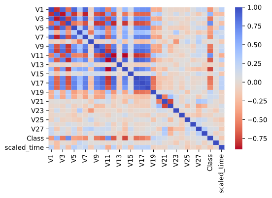

# Credit Card Fraud Prediction

A model to classify wether a credit card transaction is fraudulent or no.

The prediction was done using the Isolation Forest Algorithm.  
It gave a accuracy score of 0.9977177767634563.  
Confusion Matrix  

From the confusion matrix it is clear that the prediction for majority of non fraud transactions is correct while the prediction for the fraud transaction is not. Only approximately 30% of fraudulent transactions are detected. Even though the combined accuracy is very high the goal is to correctly predict the fraud transactions as a wrongly detected fraud transaction .ie. a false negative might be much more harmful.  

## Sub-sampling method
Since the dataset is imbalanced we will need to perform some balancing techniques so that our model doesn't just assume that it is not a fraud.  
First since the Time and Amount column have not been dimensionally reduced or scaled we scale it using RobustScaler.  
Looking at the heatmap we can infer that V2,V4,V11,V19 are positively correlated while V10,V12,V14,V16 are negatively correlated.  

    

  
After removing the outliers 852 instances remain out of 984 this may or may not cause data loss.
