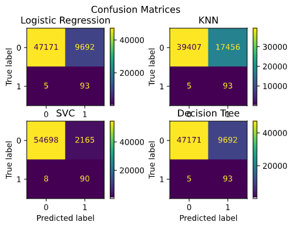

# Credit Card Fraud Prediction

A model to classify wether a credit card transaction is fraudulent or no.

The prediction was done using the Isolation Forest Algorithm.  
It gave a accuracy score of 0.9977177767634563.  
Confusion Matrix  

From the confusion matrix it is clear that the prediction for majority of non fraud transactions is correct while the prediction for the fraud transaction is not. Only approximately 30% of fraudulent transactions are detected. Even though the combined accuracy is very high the goal is to correctly predict the fraud transactions as a wrongly detected fraud transaction .ie. a false negative might be much more harmful.  

## Sub-sampling method  
Since the dataset is imbalanced we will need to perform some balancing techniques so that our model doesn't just assume that it is not a fraud.  
First since the Time and Amount column have not been dimensionally reduced or scaled we scale it using RobustScaler.  
Looking at the heatmap we can infer that V2,V4,V11,V19 are positively correlated while V10,V12,V14,V16 are negatively correlated.  
 

    

 

After removing the outliers 852 instances remain out of 984 this may or may not cause data loss.  
After using a bunch of classifiers we get the cross_val_score as:-
1. Logistic Regression: 89.45%
2. K Nearest Neighbours: 90.62%
3. Support Vector Classifier: 90.05%
4. Decision Tree Classifier: 86.92%

But if we look at the max score instead of the mean we find that Logistic Regression did the best along with KNN at 94.29%  .

After hyperparameter optimization using GridSearchCV the scores are:-
1. Logistic Regression: 95.59%
2. K Nearest Neighbours: 96.18%
3. Support Vector Classifier: 94.71%
4. Decision Tree Classifier: 95.59%

The ROC scores are:-
1. Logistic Regression: 0.9781
2. K Nearest Neighbours: 0.9310
3. Support Vector Classifier: 0.9768
4. Decision Tree Classifier: 0.9418

Looking at the scores we find that KNN give the best accuracy followed by Logistic Regression. But Logistic Regression had the highest ROC score.  
After using undersampling we find that the accuracy score for Logistic regression is only 76% and that for KNN is 67.45% while the recall scores are 0.9213 and 0.9341 respectively.  
Here is the confusion matrices for the different classifiers based on normally distributed test data:-
 

    

  

From hear we can see that both KNN and SVC have same accuracy but KNN is better suited as it correctly classifies more fraudulent transactions. Though the results may differ when the complete dataset is used.  
 

    

  

As it can be seen from the confusion matrix SVC and Logistic REgression are the best. Though Logistic regression has greater number of true positives.
Upon using SMOTE Logistic regression performed lot better with an accuracy of 97.01% and the recall is 0.9137.  

Confusion matrix for undersample tensorflow model  
 

    

  

From the confusion matrix we can see that it performed well in case of fraud results but not so much in case of normal transactions. This model might be better when it is more important to determine the fraud transaction correctly.   

Confusion matrix for SMOTE tensorflow model  
 

    

   

The model with the SMOTE performed execptionally well in case of normal transactions but not in case of fraud transactions. This might be due to the fact that the outliers were'nt removed from the dataset.

 

    

  
Even after the outlier removal the results didnt change much. Though the overall model could be improved by adding more layers.

# Instructions to replicate:
This project is done in VS code python interactive shell so it may give errors in other IDE's and code editors. If you are running this on VS code just execute the cells you want to see the output off. **Model building and preprocessing might take time ~10 mins.**  
If you want to just predict use the models in the [models](models) directory. They are tensorflow/keras models so use that to load it.

# Details:
* Name: Burhanuddin Rangwala
* Roll No: 1911109
* Class: B
* Course: Computer Engineering
* College: KJ Somaiya College of Engineering
